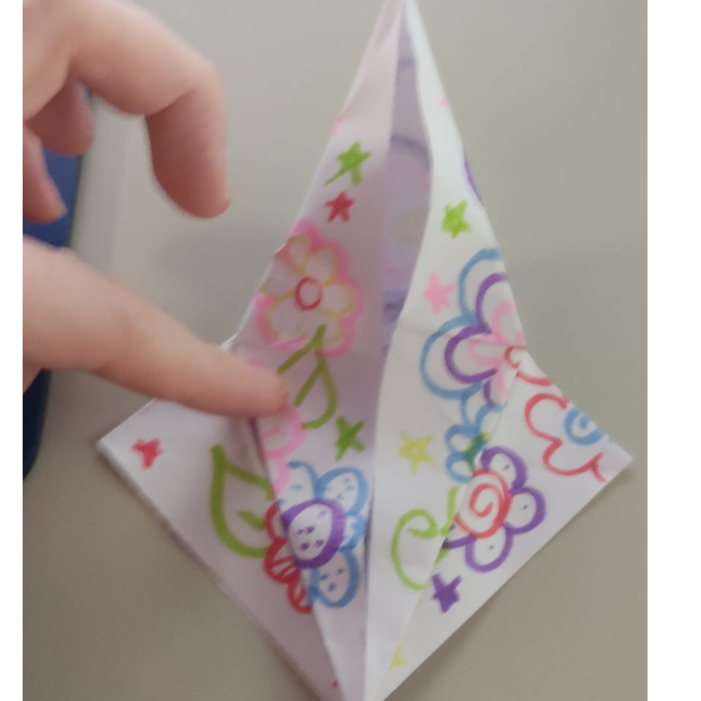

# ManualTsuru
tutorial de como fazer um Tsuru(dobradura)
# Manual de Origami - Tsuru

## Passo 1
Corte um quadrado de 15 cm, no papel dupla face da cor de sua preferência.  

## Passo 2
Vire-o, colocando o lado sem cor para cima e na diagonal (forma de losângulo).  

## Passo 3
Dobre-o ao meio de forma que as pontas se encontrem. Passe as mãos várias vezes sobre a dobra de forma que ela fique bem marcada.  

## Passo 4
Repare que o losângulo, depois de dobrado, assumiu a forma de um triângulo. Inverta a sua posição, colocando a base para cima e o bico para baixo.  

## Passo 5
Pegue a lateral da base e una-a à outra lateral da base. Bico com bico e marque bem as dobras. Novamente formamos um triângulo, só que desta vez, de tamanho menor.  

## Passo 6
Agora, pegue a pontinha deste último bico (somente o de cima) e levante-a.  

## Passo 7
Ainda segurando a base com a mão, separe as laterais do bico que você levantou. Agora, pegue a pontinha do bico e una-a com o bico inferior da base. Passe a unha várias vezes sobre as dobras para marcá-las bem.  

## Passo 8
Agora, vire o trabalho e repita este último passo no bico que sobrou. Repare que agora temos novamente um losângulo.  

## Passo 9
Passe as unhas várias vezes sobre as dobras do losângulo para que elas fiquem bem marcadas.  

## Passo 10
Perceba que o losângulo formado possui um bico de pontas soltas. Cuide para que estas pontas fiquem no sentido “para baixo”. Agora, pegue o primeiro bico da lateral e dobre-o até a metade do losângulo. Marque bem a dobra feita.  

## Passo 11
Faça o mesmo com a ponta lateral do outro lado.  

## Passo 12
Agora, pegue o bico superior do losângulo, formado sobre estas últimas duas dobraduras, e dobre-o sobre o trabalho. Marque bem a última dobra, passando as unhas sobre ela e depois levante-a.  

## Passo 13
Abra, também, as duas últimas dobraduras, voltando o losângulo ao que era antes.  

## Passo 14
Repare, com muita atenção, que ao desfazermos esses últimos passos, criamos a marca de um triângulo invertido dentro do próprio losângulo. Você deverá, agora, pegar a ponta inferior do losângulo, desunindo-a das outras pontas, e levantá-la até a marca feita na parte superior.  

## Passo 15
Depois de levantar a ponta, pegue o bico lateral da parte levantada e dobre-o até a metade do trabalho, seguindo as marcas deixadas pelos passos anteriores. Vá passando os dedos lentamente sobre as marcas, ajeitando o papel.  

## Passo 16
Faça o mesmo com o bico da outra lateral.  

## Passo 17
Vire o trabalho. Repare que o losângulo possui uma marca central. Dobre os bicos laterais até se encontrarem nesta marca.  

## Passo 18
Novamente, pegue o pequeno triângulo central e dobre-o sobre o trabalho.  

## Passo 19
Levante o pequeno triângulo. Volte as últimas laterais dobradas para os seus lugares. Repare novamente que apareceu a marca de um triângulo dentro do losângulo.  

## Passo 20
Novamente, levante o bico do losângulo (somente a parte de cima) até onde a marca permite e dobre as laterais até o meio do trabalho (conforme feito anteriormente). Ajeite o trabalho passando levemente os dedos sobre as dobras.

## Passo 21
Formamos, novamente, um losângulo. Agora, pegue o bico lateral do losângulo e dobre-o, levando junto toda a parte inferior até o meio do trabalho. Marque bem a dobradura e faça o mesmo com a outra ponta.

## Passo 22
Vire o trabalho e dobre as pontas laterais conforme passo acima.

## Passo 23
Agora, você deverá unir as duas laterais do losângulo. Repare que ao unir as duas laterais, continuamos com o mesmo desenho anterior, porém sem recortes no losângulo central. Vire e faça o mesmo com as laterais do outro lado.

## Passo 24
Pegue o bico inferior (só o de cima) e dobre-o até a marca, unindo-o com os bicos superiores. Passe a unha sobre as dobras, definindo-as.

## Passo 25
Vire o trabalho e faça o mesmo com a outra ponta inferior.

## Passo 26
Mais uma vez, una as laterais, dos dois lados, colocando para dentro as pontas finas.

## Passo 27
Agora, segurando firmemente a base do trabalho, pegue uma das pontas escondidas no meio do trabalho e puxe-a levemente para fora, até que ela alcance a mesma posição lateral que o resto do papel.

## Passo 28
Faça o mesmo com a outra ponta central, escondida no meio do trabalho. Repare que o trabalho tomou o formato de uma coroa real.

## Passo 29
Escolha um dos biquinhos e dobre a sua pontinha, formando um biquinho.

## Passo 30
Finalize puxando para fora os dois bicos centrais, abrindo as asas do pássaro. Está pronto o seu Tsuru!
